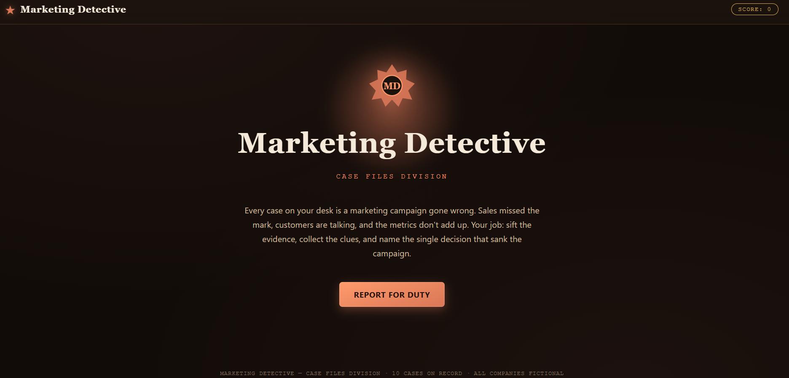
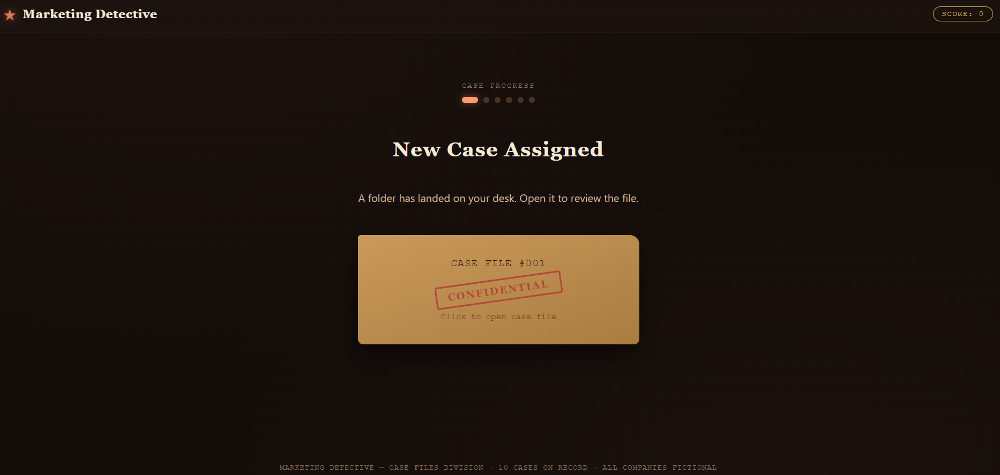
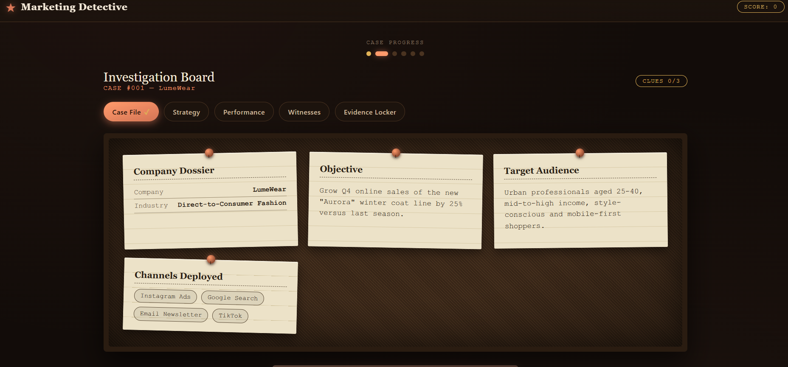
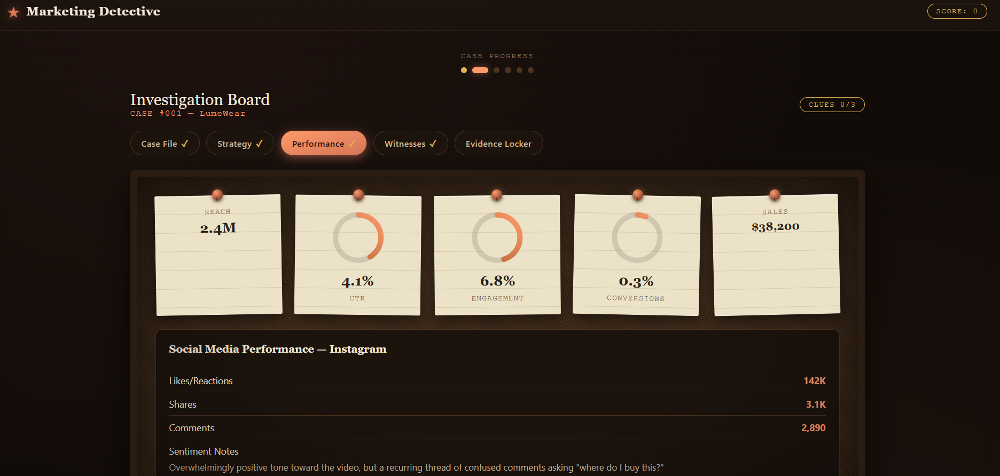
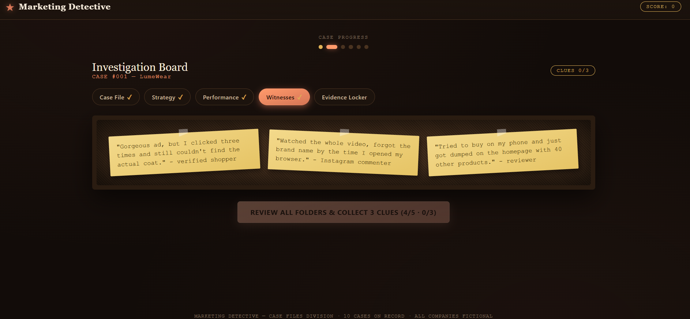
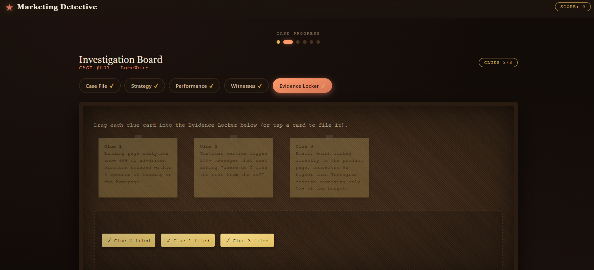
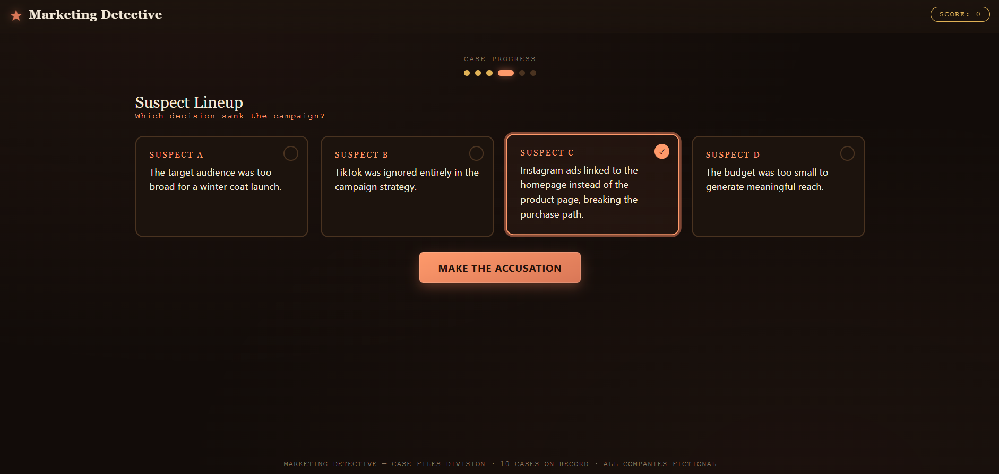
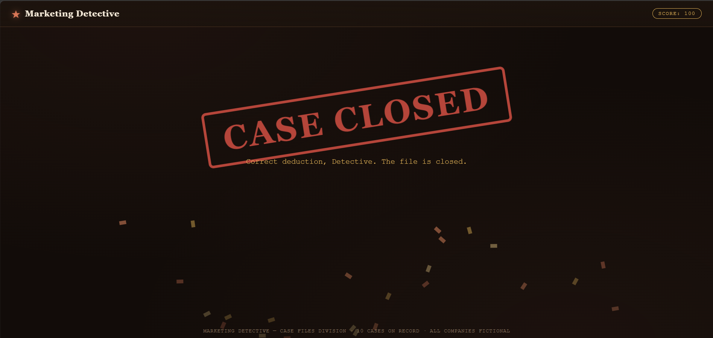
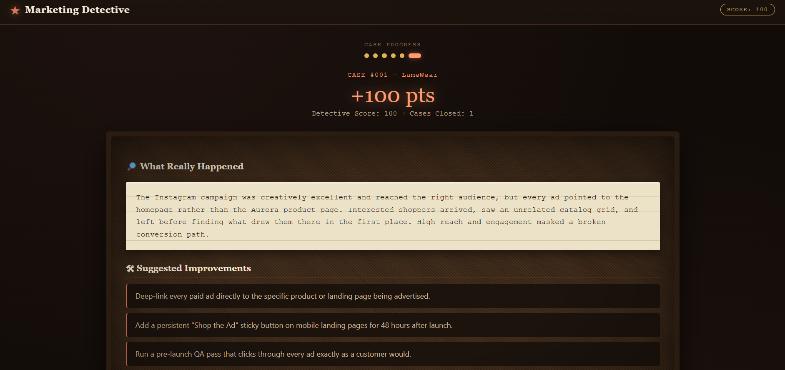

# 🔎 Marketing Detective

A single-file, offline-capable detective game that teaches marketing strategy through investigation instead of instruction. Every "case" is a fictional campaign gone wrong — you read the file, examine the evidence, collect clues, and name the decision that sank it.

No build step. No backend. No dependencies to install. Open the HTML file and the whole case-files division is live in your browser.

---

## 🕵️ What it does

Marketing Detective turns marketing-mistake analysis into a game loop instead of a checklist:

1. **Case Assignment** — a case folder lands on your desk; click to open it.
2. **Investigation Board** — a tabbed corkboard holds the Case File, Strategy, Performance, and Witnesses folders, each styled like pinned index cards, sticky notes, and social-performance readouts with animated gauges and bar charts.
3. **Evidence Locker** — three supporting clues sit scattered on the board. Drag (or tap) each one into the locker before you're allowed to accuse anyone.
4. **Suspect Lineup** — pick the one decision, among four plausible options, that actually caused the campaign to fail.
5. **Case Closed** — a stamped, animated verdict screen reveals whether you got it right.
6. **Learning Report** — the real explanation and a set of concrete, actionable improvements, plus your running Detective Score.

Every replay randomly loads a new case (never repeating the one you just closed), so the game holds up across many playthroughs.

## 🎮 Why it's built this way

The goal was to make *curiosity* the mechanic, not the decoration:

- Metrics and clues are revealed progressively across folders/tabs rather than dumped on one screen, so each tab is a small "what does this mean" moment.
- The Evidence Locker gates the solve step — you have to actually look at every folder and file every clue before the game lets you accuse anyone.
- The suspect options are all *plausible* marketing explanations, not one obviously-right answer next to three throwaway distractors, so the deduction has to be evidence-based.

## 📸 Screenshots

All screenshots live in the `screenshots/` folder next to this README — keep that folder alongside `marketing_detective.html` when you push to GitHub and the images below will render automatically.

**Title Screen**

**Case Assignment**

**Investigation Board — Case File**

**Investigation Board — Performance**

**Investigation Board — Witnesses**

**Evidence Locker**

**Suspect Lineup**

**Case Closed**

**Learning Report**

## 🧩 Case content

10 fully-detailed fictional investigations spanning fashion e-commerce, mobile fitness, coffee subscriptions, B2B SaaS, clean beauty, EVs, travel booking, mobile gaming, consumer fintech, and international home goods. Each case includes:

- Company name, industry, and campaign objective
- Target audience and marketing channels used
- Budget allocation across channels
- Campaign metrics (reach, CTR, engagement, conversions, sales)
- Customer comments and social media performance
- One primary marketing mistake + three supporting clues
- A full explanation of what actually went wrong
- A list of suggested improvements

All companies, people, and data are fictional and created for this project.

## 🛠️ Tech stack

- **React 18** + **Babel Standalone**, loaded via CDN (`unpkg`/`jsdelivr`), transformed in-browser — no `npm`, no bundler, no build step
- Plain CSS (custom properties, gradients, keyframe animations) — no Tailwind, no CSS framework
- Zero external assets — every visual (corkboard texture, push pins, folders, sticky notes, gauges, bar charts, confetti) is drawn with CSS/SVG
- Zero backend, zero database, zero external API calls — case data lives in a single in-file JavaScript array

## 🚀 Running it

1. Download `marketing_detective.html`
2. Double-click it, or open it in any modern browser (Chrome, Edge, Firefox, Safari)
3. That's it — an internet connection is only used to fetch the React/Babel CDN scripts on first load

No installation, no server, no configuration.

## 🎨 Design

Dark "detective noir" aesthetic built around a warm amber/orange accent palette, with corkboard textures, paper-grain index cards, push pins, folder tabs, and sticky notes. Typewriter and serif type pairing reinforces the case-file tone. All interactive elements (tabs, drag targets, suspect cards, buttons) have hover and focus states, and animations respect `prefers-reduced-motion`.

## 📈 Possible extensions

- Persist Detective Score and cases-closed count across sessions (e.g., `localStorage`)
- Add difficulty tiers that hide fewer or more clues per case
- Expand the case library beyond the current 10 investigations
- Add a timer-based "rank" (Rookie → Senior Detective → Chief Investigator)

---

*Built as a self-contained educational simulation — part of a portfolio of no-dependency, single-file interactive learning tools.*
